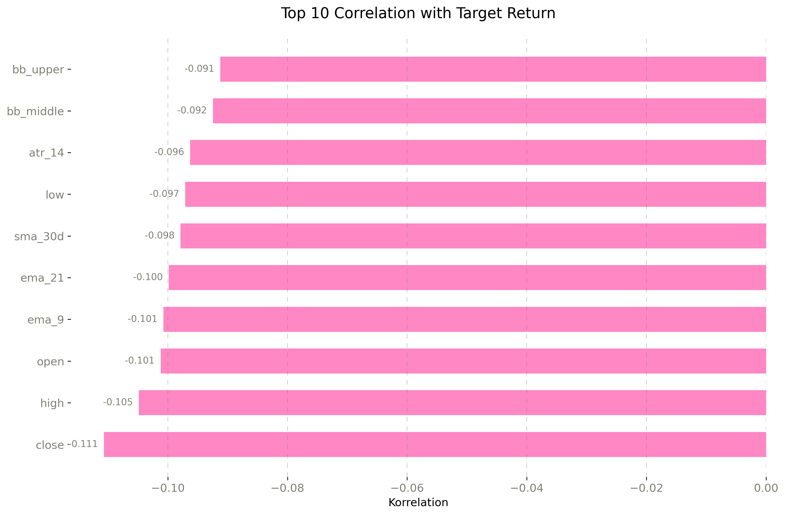
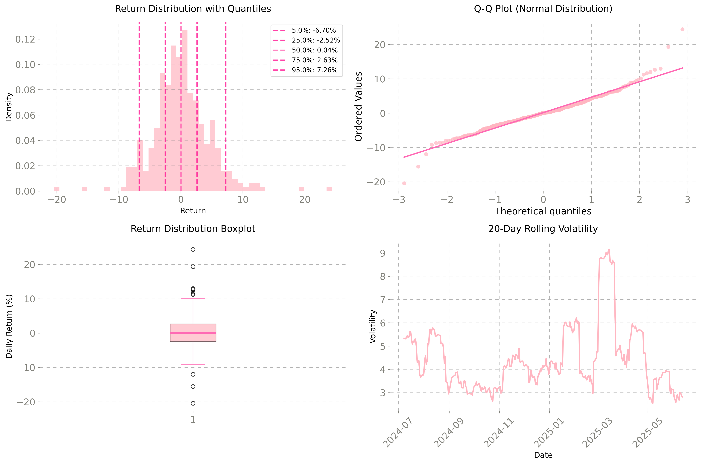
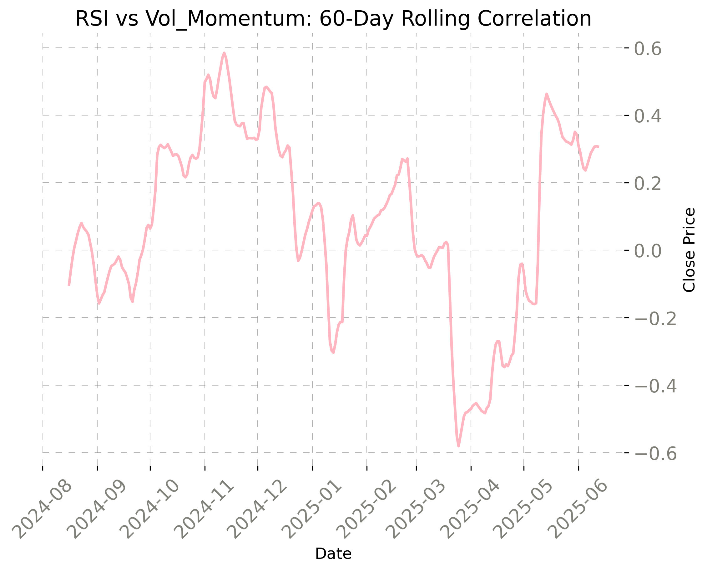
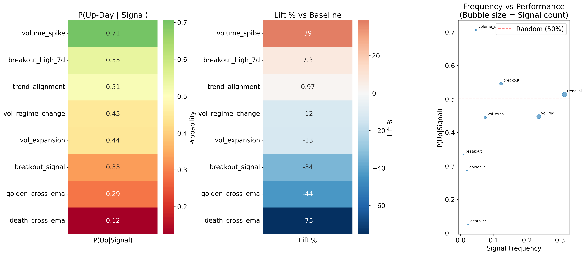
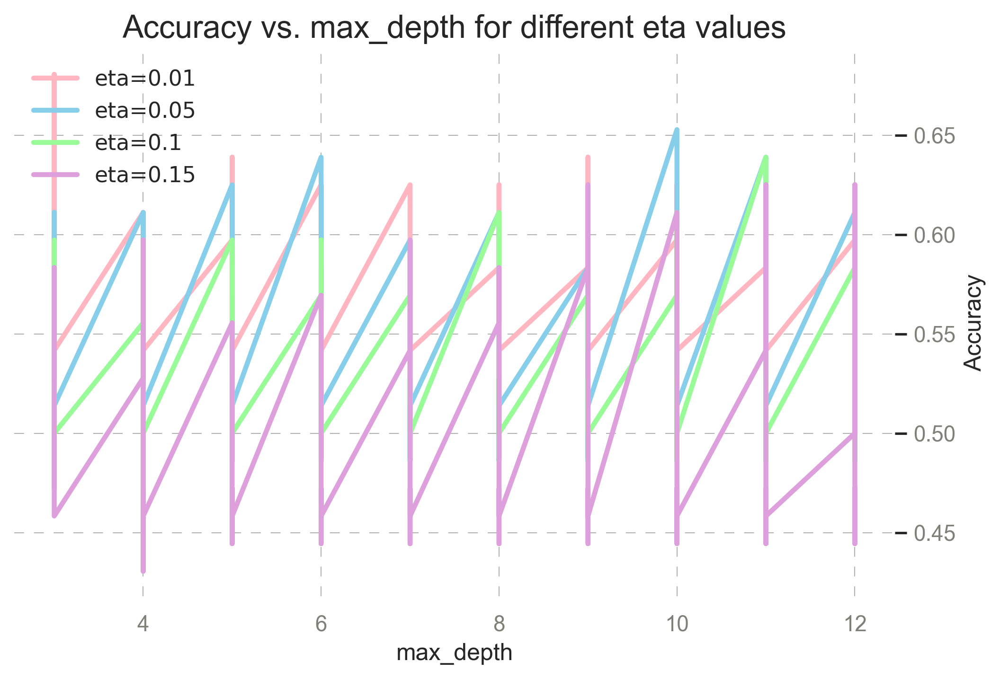
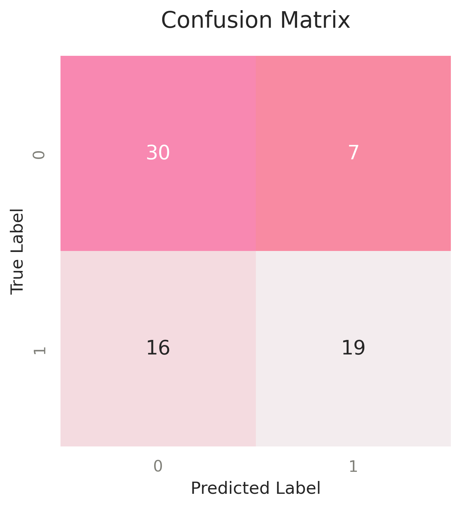
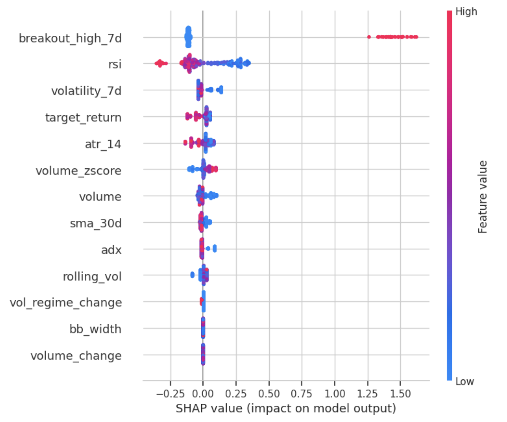

This repository is part of my data science & quant portfolio.  
I am actively looking for opportunities in quantitative research, algorithmic trading, and data-driven strategy development.

# Solana Trading Strategy: Statistical and Machine Learning Approach
 

## Overview
This project is about statistical anlysis and trading strategies for the cryptocurrency Solana (SOL). It includes data acquisition, creating new features, statistical analysis, probability modeling, feature engineering, and the development of rule-based and machine learning-based trading strategies.     
I fitted different probability distributions (Normal, Exponential, Gamma, Weibull, Poisson) and Bayes to daily return data.

The goal is to explore the dynamics of daily SOL price movements and to build strategies.  

Best found Strategy:

```bash
Initial Capital: $10,000
Final Value: $17,918
Total Return: 79.2%
Number of Trades: 15
Win Rate: 86.7%
Avg Return per Trade: 4.04%
Annualized Volatility: 21.8%
Max Drawdown: -2.9%
Sharpe Ratio: 3.54
```

# Project Steps
   
### Data Collection

* Retrieved 1 day OHLCV data for Solana (SOL/USDT) over the past 365 days using the Binance API   

* Data Cleaning & Preprocessing 

* Feature Engineering


### Exploratory Data Analysis (EDA)

```bash
Mean return: 0.14
Median return: 0.04
Volatility: 4.58
Skewness: 0.44
Kurtosis: 3.78
Daily Sharpe: 0.03
Annual Sharpe: 0.60

Q1 (25%): -2.52
Q3 (75%): 2.63
VaR 95%: -6.70%
VaR 99%: -8.93%
```
* SOL shows positive expected returns (0.14% daily) but with high volatility (4.58%)
* Distribution is right-skewed with fat tails, more extreme moves
* Significant downside risk: 5% chance of losing >6.7% in a single day
* Decent risk-adjusted returns (Sharpe 0.60) 
* Strong outliers

Calculated daily returns: 




Key insights:    

* Returns show normal distribution in the center but with significant fat tails 
* Extreme price movements occur much more frequently than normal distribution would predict

* Q-Q Plot: 
* Deviation from the red line at extremes confirms fat-tail behavior
* Standard risk models will consistently underestimate actual risk exposure

* Box Plot: 
* Numerous outliers beyond typical range, both positive and negative

* Volatility Clustering: 
* Low volatility periods followed by high volatility spikes, particularly visible in early 2025
* High volatility periods cluster together
* Quiet phases (3-4%) alternating with turbulent periods (up to 9%)
* Volatility forecasting models could be highly valuable

* Strategic Implications:

* Dynamic position sizing based on current volatility regime
* Volatility based strategy, vol (<3%): bigger positions, vol(>6%): smaller positions
* Trading vol breakouts from <3% to >5% after that bigger movements tend to follow
* Contrarian position after 8% move

    
* Correlation:   




### Bayes Indicator Analysis

* Calculates p(up|signal) vs baseline probability for binary trading indicators
* Performance metrics: calculactes lift percentage, signal frequency, and statistical significance for each indicator

* heatmaps for probability, lift %, and frequency vs performance scatter plots



* signal combinations: tests combinations of best performing bullish/bearish indicators
* trading signal generation: filters significant indicators based on minimum lift and frequency thresholds

```bash
=== BAYES ANALYSIS FOR ALL INDICATORS ===
Baseline P(Up-Day) = 0.508
------------------------------------------------------------
vol_expansion             | P(Up|Signal)=0.444 | Lift=-0.064 (-12.6%) | Freq=0.075 | 🔴 BEARISH
volume_spike              | P(Up|Signal)=0.706 | Lift=+0.198 (+38.9%) | Freq=0.047 | 🟢 BULLISH
breakout_signal           | P(Up|Signal)=0.333 | Lift=-0.175 (-34.4%) | Freq=0.008 | 🔴 BEARISH
extreme_down              | P(Up|Signal)=0.600 | Lift=+0.092 (+18.0%) | Freq=0.014 | 🟢 BULLISH
extreme_up                | P(Up|Signal)=0.444 | Lift=-0.064 (-12.6%) | Freq=0.025 | 🔴 BEARISH
vol_regime_change         | P(Up|Signal)=0.447 | Lift=-0.061 (-12.1%) | Freq=0.236 | 🔴 BEARISH
golden_cross_ema          | P(Up|Signal)=0.286 | Lift=-0.223 (-43.8%) | Freq=0.019 | 🔴 BEARISH
death_cross_ema           | P(Up|Signal)=0.125 | Lift=-0.383 (-75.4%) | Freq=0.022 | 🔴 BEARISH
breakout_high_7d          | P(Up|Signal)=0.545 | Lift=+0.037 (+7.3%) | Freq=0.122 | ⚪ NEUTRAL
trend_alignment           | P(Up|Signal)=0.513 | Lift=+0.005 (+1.0%) | Freq=0.314 | ⚪ NEUTRAL
extreme_reversal_setup    | P(Up|Signal)=0.333 | Lift=-0.175 (-34.4%) | Freq=0.008 | 🔴 BEARISH


P(Up-Day | vol_regime = 0) = 0.598 (n=87)
P(Up-Day | vol_regime = 1) = 0.471 (n=187)
P(Up-Day | vol_regime = 2) = 0.500 (n=86)

```

* Findings:
* Indicators are predominantly BEARISH, most signal market weakness 
* Volume spike: 70.6% up probability (+38.9% lift), occurs 4.7% of time -> strong bullish indicator when unusual volume
* Extreme down: 60% success rate (+18% lift) -> could be weighted heavier in strategy but very rare
* Volume expansion: 44.4% up probability (-12.6% lift), occurs 7.5% of time -> expanding volume without direction is bearish
* Extreme up: 44.4% up probability (-12.6% lift), occurs 2.5% of time -> overbought conditions lead to pullbacks

   
   

### POISSON EVENTS ANALYSIS  
   
* How often do large moves happen:

```bash
POISSON EVENTS ANALYSIS
----------------------------------------
Weeks analyzed: 52
Total big moves (>7%): 81
Average big moves per week: 1.56
Probability of 0 big moves in a week: 21.1%
Probability of exactly 1 big move: 32.8%
Probability of 2+ big moves in a week: 46.1%
Probability of 4+ big moves in a week: 7.3%
```

   
### EXPONENTIAL VOLATILITY ANALYSIS

Expected daily fluctuation is 4.21%, with right-skewed distribution signaling most volatility is low, but large spikes do occur. Expected time between high-volatility days: ~5 trading days:   
   
```bash
EXPONENTIAL VOLATILITY ANALYSIS
----------------------------------------
Volatility observations: 354
Mean volatility: 4.20%
Exponential lambda: 0.304
High volatility threshold: 6.18%
Probability of high volatility: 20.1%
Probability of extreme volatility: 5.0%
Expected days between high vol periods: 5.0
```


### WEIBULL DURATION OF VOLATILITY   
     
```bash   
============================================================
COMPREHENSIVE WEIBULL ANALYSIS FOR SOL
============================================================
WEIBULL VOLATILITY BURST DURATION ANALYSIS
--------------------------------------------------
Volatility bursts found: 23
Average burst duration: 3.7 days
Weibull shape parameter: 1.53
Weibull scale parameter: 4.17
Shape > 1: Increasing hazard rate (bursts tend to end quickly)
Probability burst ends within 3 days: 45.4%
Probability burst lasts >10 days: 2.2%
TRADING INSIGHT: Volatility bursts typically end quickly
   → Fade volatility spikes after 2-3 days

WEIBULL EXTREME EVENT CLUSTERING ANALYSIS
--------------------------------------------------
Extreme events found: 36
Average time between extremes: 9.0 days
Weibull shape: 0.95
Weibull scale: 8.72
 CLUSTERING DETECTED: Extreme events come in clusters
   → After one extreme event, expect another soon
After extreme event, prob of another within 5 days: 44.6%
Probability of >30 days without extreme event: 4.0%

WEIBULL BREAKOUT SUSTAINABILITY ANALYSIS
--------------------------------------------------
Sustainable breakouts found: 11
Average breakout duration: 2.5 days
Weibull shape: 4.03
Weibull scale: 2.80
MOMENTUM FADES: Breakouts lose steam over time
   → Take profits early in breakouts
Probability breakout ends within 3 days: 73.2%
Probability breakout extends >10 days: 0.0%
Median breakout duration: 2.6 days
STRATEGY: Set initial profit target around day 3

============================================================
WEIBULL INSIGHTS SUMMARY
============================================================
Volatility bursts typically end quickly - fade vol spikes
Extreme events cluster - implement cooling-off periods
Breakout momentum fades - take profits early
```     

### XGBOOST FEATURE ANALYSIS AND MODEL

An XGBoost classifier to predict next day return bigger than 5% was trained. 

```bash 
y = (df['return'] > 0.05).astype(int)
```

After tuning hyperparameters, the results are:
```bash 
Accuracy:  0.6806
Precision: 0.7308
Recall:    0.5429
F1 Score:  0.6230
```





Performed feature selection using SHAP values. The most important features for the model are:




### TRADING STRATEGY BASED ON INSIGHTS

#### Simple Strategy Based on XGBOOST

Final Capital: $11899.60
Total Return: 19.00%
Long Signals: 15 | Exit Signals: 232
Sharpe Ratio: 0.88
Annualized Volatility: 22.96%
Max Drawdown: -9.35%


The XGBoost-based long-only strategy yielded a 19.00% return over the 12-month period, with a Sharpe ratio of 0.88 and a maximum drawdown of -9.35%.
Only 15 long entries were triggered, indicating low trading frequency.
No transaction costs or slippage were included.


### Regime Aware Strategy with Backtest on XGBOOST


Signals: 15 entries identified, 232 exit signals processed

Indicators used: vol_regime, prediction_proba, rsi, breakout_high_7d

Fixed Position Sizing (1.00x per trade)

Return: +19.95%

Sharpe Ratio: 3.27

Max Drawdown: -9.83%

Trades: 9

Win Rate: 55.6%

Avg Return per Trade: +2.30%

### Volatility-Regime-Based Position Sizing (0.50x–1.00x)

Return: +20.03%

Sharpe Ratio: 3.21

Max Drawdown: -7.71%

Trades: 9

Win Rate: 66.7%

Avg Return per Trade: +2.45%

Key Observations

Volatility-adjusted sizing led to slightly better risk-adjusted performance and lower drawdown.

High conviction signals (prediction_proba ≈ 0.79) paired with regime awareness showed promising trade-offs.

Strategy adapts position sizes based on volatility regime:

LOW_VOL → 1.00x

MID_VOL → 0.75x

HIGH_VOL → 0.50x


Tools & Libraries:
Python (pandas, numpy, scikit-learn, xgboost, scipy, statsmodels, shap, matplotlib, seaborn)

Caution:
Backtest-Performance ≠ Live-Performance
Overfitting-Risik
Transactioncost, Slippage not included in Calculations

Next Steps:
Test Strategies in Live Performance.

Solana Data:      
[Link to Solana Dataset](https://drive.google.com/file/d/1voYH8gYeAXWd2MIM7w4720hSbXBrOpdc/view?usp=sharing) 


