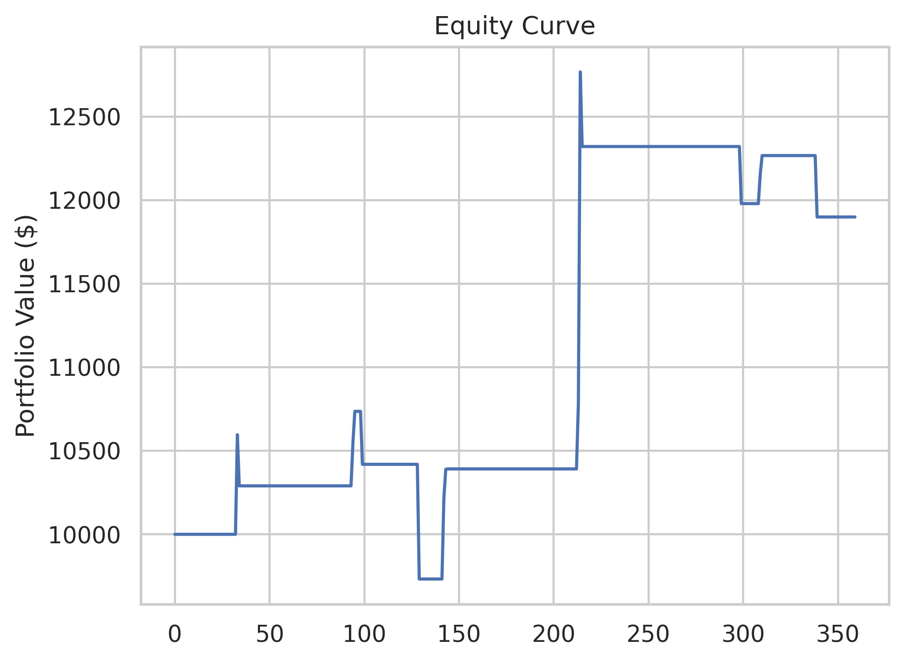

# Probabilistic Trading Strategy for Solana
    
**🦄 Looking for Work:** Quantitative Research | Algorithmic Trading | Data-Driven Strategy Development | Data Science
    
## Executive Summary
This project applies statistical modeling and machine learning to analyze Solana (SOL) price behavior and design profitable trading strategies.
Using probability theory, Bayesian indicator evaluation, and XGBoost modeling, I developed a strategy achieving:

```bash
Initial Capital: $10,000
Final Value: $17,918
Total Return: 79.2%
Number of Trades: 15
Win Rate: 86.7%
Avg Return per Trade: 4.04%
Annualized Volatility: 21.8%
Max Drawdown: -2.9%
Sharpe Ratio: 3.54
```


## Project Overview

This end-to-end pipeline covers:  
1. Data collection and cleaning   
2. Exploratory data analysis (EDA)   
3. Feature engineering using statistical and volatility-based indicators   
4. Bayesian indicator testing 
5. Probability distribution fitting (Exponential, Gamma, Weibull, Poisson)    
6. Strategy development with XGBoost and rule based logic  
7. Volatility  and regime aware risk management  

### Objective
Explore statistical properties of SOL daily returns and build robust, explainable trading strategies based on probabilistic signals and machine learning models.


### Methodology
- **Data**: 365 days SOL/USDT 1D OHLCV via Binance API
- **Validation**: Time series split, no look-ahead bias
- **Features**: technical indicators + regime variables
- **Models**: XGBoost classifier + statistical distributions
- **Risk Management**: Volatility based position sizing

### Key Results
- **Best Strategy Performance**: 79.2% return, 3.54 Sharpe ratio, -2.9% max drawdown
- **XGBoost Model**: 68% accuracy predicting >5% moves
- **Bayesian Analysis**: 70.6% success rate for volume spike signals (+38.9% lift)
- **Statistical Volatility Modelings**: Volatility bursts end within 3 days (45% probability), extreme events cluster, Breakouts lose steam quickly → take profits early

# Project Steps
   
### Data Collection

* Retrieved 1 day OHLCV data for Solana (SOL/USDT) over the past 365 days using the Binance API   

* Data Cleaning & Preprocessing 

* Engineered features: returns, volatility, regime labels, technical indicators


### Exploratory Data Analysis (EDA)

```bash
Return Distribution:
Daily mean return: +0.14%
Volatility: 4.58%
Sharpe (daily): 0.03, Sharpe (annualized): 0.60
Skewness: 0.44 (right-skewed), Kurtosis: 3.78 (fat tails)
```
        
* Return distribution has fat tails → standard models underestimate risk
* Volatility clusters over time → regime-aware strategies needed 
     

Calculated daily returns:    
   


Key insights:    
* Deviation from the red line at extremes confirms fat-tail behavior
* Standard risk models will consistently underestimate actual risk exposure
* Numerous outliers beyond typical range, both positive and negative
* Low volatility periods followed by high volatility spikes, particularly visible in early 2025
* High volatility periods cluster together
* Quiet phases (3-4%) alternating with turbulent periods (up to 9%)
* Volatility forecasting models could be highly valuable
      
* Strategic Implications:    
* Dynamic position sizing based on current volatility regime
* Volatility based strategy, vol (<3%): bigger positions, vol(>6%): smaller positions
* Trading vol breakouts from <3% to >5% after that bigger movements tend to follow
* Contrarian position after 8% move

    


     
     

### Bayes Indicator Analysis

* Used Bayesian conditional probability to evaluate signal strength.

```bash
=== BAYES ANALYSIS FOR ALL INDICATORS ===
Baseline P(Up-Day) = 0.508
------------------------------------------------------------
vol_expansion             | P(Up|Signal)=0.444 | Lift=-0.064 (-12.6%) | Freq=0.075 | 🔴 BEARISH
volume_spike              | P(Up|Signal)=0.706 | Lift=+0.198 (+38.9%) | Freq=0.047 | 🟢 BULLISH
breakout_signal           | P(Up|Signal)=0.333 | Lift=-0.175 (-34.4%) | Freq=0.008 | 🔴 BEARISH
extreme_down              | P(Up|Signal)=0.600 | Lift=+0.092 (+18.0%) | Freq=0.014 | 🟢 BULLISH
extreme_up                | P(Up|Signal)=0.444 | Lift=-0.064 (-12.6%) | Freq=0.025 | 🔴 BEARISH
vol_regime_change         | P(Up|Signal)=0.447 | Lift=-0.061 (-12.1%) | Freq=0.236 | 🔴 BEARISH
golden_cross_ema          | P(Up|Signal)=0.286 | Lift=-0.223 (-43.8%) | Freq=0.019 | 🔴 BEARISH
death_cross_ema           | P(Up|Signal)=0.125 | Lift=-0.383 (-75.4%) | Freq=0.022 | 🔴 BEARISH
breakout_high_7d          | P(Up|Signal)=0.545 | Lift=+0.037 (+7.3%) | Freq=0.122 | ⚪ NEUTRAL
trend_alignment           | P(Up|Signal)=0.513 | Lift=+0.005 (+1.0%) | Freq=0.314 | ⚪ NEUTRAL
extreme_reversal_setup    | P(Up|Signal)=0.333 | Lift=-0.175 (-34.4%) | Freq=0.008 | 🔴 BEARISH


P(Up-Day | vol_regime = 0) = 0.598 (n=87)
P(Up-Day | vol_regime = 1) = 0.471 (n=187)
P(Up-Day | vol_regime = 2) = 0.500 (n=86)

```

    


* Findings: 
* Volume spike: 70.6% up probability (+38.9% lift), occurs 4.7% of time -> strong bullish indicator when unusual volume
* Extreme down: 60% success rate (+18% lift) -> could be weighted heavier in strategy but very rare
* Volume expansion: 44.4% up probability (-12.6% lift), occurs 7.5% of time -> expanding volume without direction is bearish
* Extreme up: 44.4% up probability (-12.6% lift), occurs 2.5% of time -> overbought conditions lead to pullbacks
     
       
         

## Statistical Event Modeling

### POISSON EVENTS ANALYSIS  
   
* How often do large moves < 7% occur:

```bash
Total big moves (>7%): 81 (in 52 weeks)
Average big moves per week: 1.56
Probability of 0 big moves in a week: 21.1%
Probability of exactly 1 big move: 32.8%
Probability of 2+ big moves in a week: 46.1%
Probability of 4+ big moves in a week: 7.3%
```
→ Expect 1–2 big moves per week. Use for trade sizing

          
### EXPONENTIAL VOLATILITY ANALYSIS
  
```bash
Avg daily volatility: 4.20% 
P(volatility > 6.18%): 20.1%  
Expected time between high vol periods: 5 days
```
→ Use volatility breakouts for entry signals and fade after spikes.
    
      
### WEIBULL DURATION OF VOLATILITY   
     
```bash   
Volatility bursts found: 23
Avg duration: 3.7 days
Shape >1 → bursts end quickly
45% probability of burst ending within 3 days
→ Fade volatility after ~2 days
    
Extreme Event Clustering found: 36
After one extreme move → 44.6% chance another follows in 5 days
Probability of >30 days without extreme event: 4.0%
→ Implement post extreme logic
    
Breakout Sustainability:
Breakouts usually fade after ~3 days (73.2%)
No breakout >10 days
→ Set time-based take-profit at 2–3 days
→ Take profits early in breakouts
```     


### MACHINE LEARNING XGBOOST

Predicted whether next day return exceeds 5%:

```bash 
y = (df['return'] > 0.05).astype(int)
```

Results: 
```bash 
Accuracy:  68.1%
Precision: 73.1%
Recall:    54.3%
F1 Score:  62.3%
```
    


Used SHAP values for feature selection and interpretability.


  

  

## TRADING STRATEGY BASED ON INSIGHTS

#### Simple Strategy Based on XGBOOST

```bash 
Final Capital: $11899.60    
Total Return: 19.00%     
Long Signals: 15 | Exit Signals: 232     
Sharpe Ratio: 0.88    
Annualized Volatility: 22.96%    
Max Drawdown: -9.35%   
```  



The XGBoost-based long-only strategy yielded a 19.00% return over the 12-month period, with a Sharpe ratio of 0.88 and a maximum drawdown of -9.35%.
Only 15 long entries were triggered, indicating low trading frequency.
No transaction costs or slippage were included.


### Regime Aware Strategy with Backtest on XGBOOST

```bash 
Return: +19.95%
Sharpe Ratio: 3.27
Max Drawdown: -9.83%
Trades: 9
Win Rate: 55.6%
Avg Return per Trade: +2.30%
```

Signals: 15 entries identified, 232 exit signals processed
Indicators used: vol_regime, prediction_proba, rsi, breakout_high_7d
Fixed Position Sizing (1.00x per trade)

### Volatility-Regime-Based Position Sizing 

```bash 
Return: +20.03%
Sharpe Ratio: 3.21
Max Drawdown: -7.71%
Trades: 9
Win Rate: 66.7%
Avg Return per Trade: +2.45%
```


Volatility-adjusted sizing led to slightly better risk-adjusted performance and lower drawdown.

High conviction signals paired with regime awareness showed promising trade-offs.


### Technologies Used
Python, pandas, numpy, scikit-learn, XGBoost, SciPy, SHAP, matplotlib, seaborn

### Caution     
Backtest-Performance ≠ Live-Performance    
Overfitting Risik     
Transactioncost, Slippage not included in Calculations    

### Next Steps:
Test Strategies in Live Performance and get rich or die trying.

Solana Data:      
[Link to Solana Dataset](https://drive.google.com/file/d/1voYH8gYeAXWd2MIM7w4720hSbXBrOpdc/view?usp=sharing) 


