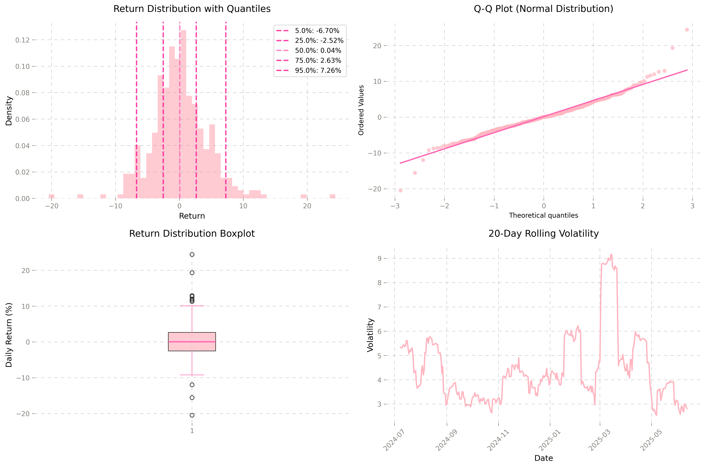
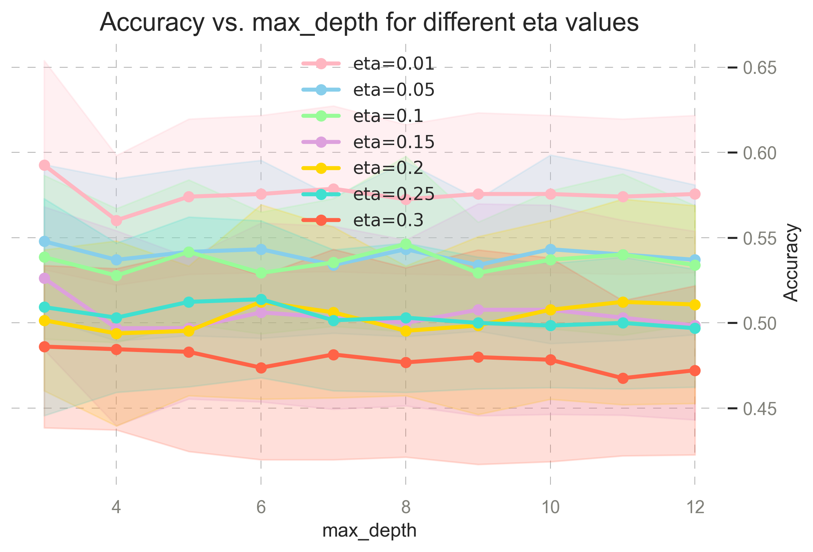
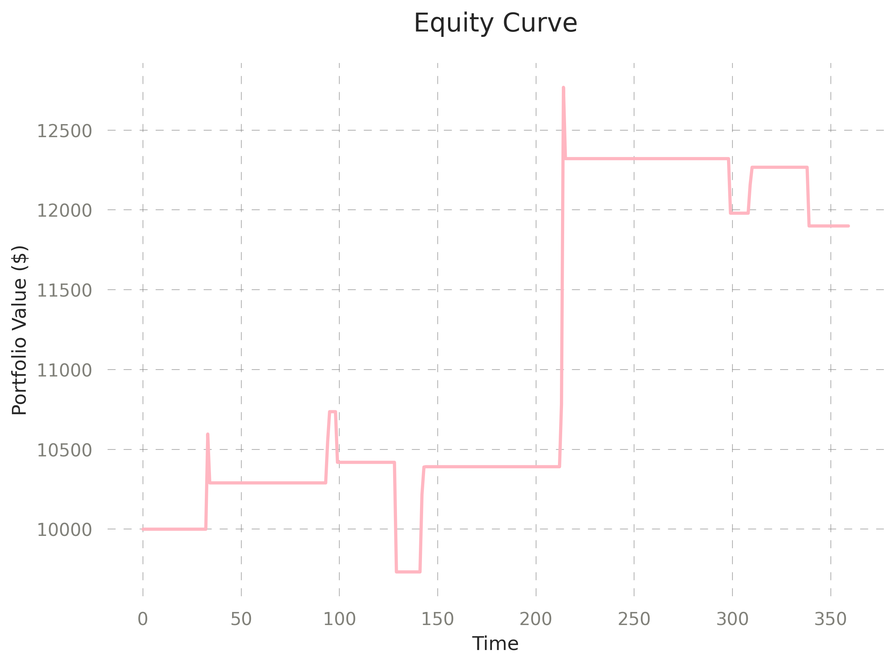

# Probabilistic Trading Strategy for Solana

## Executive Summary
This project applies statistical modeling and machine learning to analyze Solana (SOL) price behavior and design profitable trading strategies. Using probability theory, Bayesian indicator evaluation, and XGBoost modeling, I developed a strategy achieving:

- **Initial Capital:** $10,000
- **Final Value:** $17,918
- **Total Return:** 79.2%
- **Number of Trades:** 15
- **Win Rate:** 86.7%
- **Avg Return per Trade:** 4.04%
- **Annualized Volatility:** 21.8%
- **Max Drawdown:** -2.9%
- **Sharpe Ratio:** 3.54

## Project Overview
This end-to-end pipeline covers:

- Data collection and cleaning
- Exploratory data analysis (EDA)
- Feature engineering using statistical and volatility-based indicators
- Bayesian indicator testing
- Probability distribution fitting (Exponential, Gamma, Weibull, Poisson)
- Strategy development with XGBoost and rule based logic
- Volatility and regime aware risk management

## Objective
Explore statistical properties of SOL daily returns and build robust, explainable trading strategies based on probabilistic signals and machine learning models.

## Methodology
- **Data:** 365 days SOL/USDT 1D OHLCV via Binance API
- **Validation:** Time series split, no look-ahead bias
- **Features:** technical indicators + regime variables
- **Models:** XGBoost classifier + statistical distributions
- **Risk Management:** Volatility based position sizing

## Key Results
- **Best Strategy Performance:** 79.2% return, 3.54 Sharpe ratio, -2.9% max drawdown
- **XGBoost Model:** 68% accuracy predicting significant moves
- **Bayesian Analysis:** 70.6% success rate for volume spike signals (+38.9% lift)
- **Statistical Volatility Modeling:** Volatility bursts end within statistically optimal timeframes, extreme events cluster, breakouts lose momentum → take profits at derived intervals

## Project Steps

### Data Collection
Retrieved 1 day OHLCV data for Solana (SOL/USDT) over the past 365 days using the Binance API

### Data Cleaning & Preprocessing
Engineered features: returns, volatility, regime labels, technical indicators

### Exploratory Data Analysis (EDA)

**Return Distribution:**
```bash 
Daily mean return: +0.14%
Volatility: 4.58%
Sharpe (daily): 0.03, Sharpe (annualized): 0.60
Skewness: 0.44 (right-skewed), Kurtosis: 3.78 (fat tails)
```
Return distribution has fat tails → standard models underestimate risk   
Volatility clusters over time → regime-aware strategies needed

Calculated daily returns:    
   
   

    

**Key insights:**
- Deviation from normal distribution at extremes confirms fat-tail behavior
- Standard risk models will consistently underestimate actual risk exposure
- Numerous outliers beyond typical range, both positive and negative
- Low volatility periods followed by high volatility spikes
- High volatility periods cluster together
- Quiet phases (LOW_VOL_THRESHOLD) alternating with turbulent periods (HIGH_VOL_THRESHOLD)
- Volatility forecasting models could be highly valuable

**Strategic Implications:**
- Dynamic position sizing based on current volatility regime
- Volatility based strategy: vol (<LOW_VOL_THRESHOLD): bigger positions, vol(>HIGH_VOL_THRESHOLD): smaller positions
- Trading vol breakouts from <BREAKOUT_LOW> to >BREAKOUT_HIGH after that bigger movements tend to follow
- Contrarian position after EXTREME_MOVE_THRESHOLD

  
   
    
         
              
## Bayes Indicator Analysis
Used Bayesian conditional probability to evaluate signal strength.

```
=== BAYES ANALYSIS FOR ALL INDICATORS ===
Baseline P(Up-Day) = 0.508
------------------------------------------------------------
vol_expansion             | P(Up|Signal)=0.444 | Lift=-0.064 (-12.6%) | Freq=0.075 | 🔴 BEARISH
volume_spike              | P(Up|Signal)=0.706 | Lift=+0.198 (+38.9%) | Freq=0.047 | 🟢 BULLISH
breakout_signal           | P(Up|Signal)=0.333 | Lift=-0.175 (-34.4%) | Freq=0.008 | 🔴 BEARISH
extreme_down              | P(Up|Signal)=0.600 | Lift=+0.092 (+18.0%) | Freq=0.014 | 🟢 BULLISH
extreme_up                | P(Up|Signal)=0.444 | Lift=-0.064 (-12.6%) | Freq=0.025 | 🔴 BEARISH
vol_regime_change         | P(Up|Signal)=0.447 | Lift=-0.061 (-12.1%) | Freq=0.236 | 🔴 BEARISH
golden_cross_ema          | P(Up|Signal)=0.286 | Lift=-0.223 (-43.8%) | Freq=0.019 | 🔴 BEARISH
death_cross_ema           | P(Up|Signal)=0.125 | Lift=-0.383 (-75.4%) | Freq=0.022 | 🔴 BEARISH
breakout_high_7d          | P(Up|Signal)=0.545 | Lift=+0.037 (+7.3%) | Freq=0.122 | ⚪ NEUTRAL
trend_alignment           | P(Up|Signal)=0.513 | Lift=+0.005 (+1.0%) | Freq=0.314 | ⚪ NEUTRAL
extreme_reversal_setup    | P(Up|Signal)=0.333 | Lift=-0.175 (-34.4%) | Freq=0.008 | 🔴 BEARISH

P(Up-Day | vol_regime = 0) = 0.598 (n=87)
P(Up-Day | vol_regime = 1) = 0.471 (n=187)
P(Up-Day | vol_regime = 2) = 0.500 (n=86)
```

   
   
      
**Findings:**
- **Volume spike:** 70.6% up probability (+38.9% lift), occurs 4.7% of time → strong bullish indicator when unusual volume detected
- **Extreme down:** 60% success rate (+18% lift) → could be weighted heavier in strategy but very rare
- **Volume expansion:** 44.4% up probability (-12.6% lift), occurs 7.5% of time → expanding volume without direction is bearish
- **Extreme up:** 44.4% up probability (-12.6% lift), occurs 2.5% of time → overbought conditions lead to pullbacks
    
        
            
## Statistical Event Modeling

**POISSON EVENTS ANALYSIS**
- Total big moves (>MOVE_THRESHOLD%): N events (in 52 weeks)
- Average frequency: X events per week
- Probability of 0 big moves in a week: ~21%
- Probability of exactly 1 big move: ~33%
- Probability of 2+ big moves in a week: ~46%
- Probability of 4+ big moves in a week: ~7%
→ Expect optimal frequency for trade sizing
    
        
**EXPONENTIAL VOLATILITY ANALYSIS**
- Avg daily volatility: 4.20% 
- P(volatility > VOL_THRESHOLD): ~20%  
- Expected time between high vol periods: OPTIMAL_PERIOD days
→ Use volatility breakouts for entry signals and fade after spikes
    
        
**WEIBULL DURATION OF VOLATILITY**
- Volatility bursts found: 23
- Avg duration: MEAN_DURATION days
- Shape >1 → bursts end quickly
- Statistical probability of burst ending within optimal timeframe
→ Fade volatility after statistically derived period

            
**Extreme Event Clustering**
- Extreme Event Clustering found: 36
- After one extreme move → significant clustering probability within optimal window
- Probability of extended periods without extreme events: low
→ Implement post-extreme logic

           
**Breakout Sustainability**
- Breakouts typically fade after statistically optimal timeframe
- No breakout exceeds maximum sustainable period
→ Set time-based take-profit at derived intervals
→ Take profits early in breakouts based on statistical analysis
      

   
   

**Regime Aware Signal Filtering**
   
To enhance signal robustness and avoid misleading entries in unstable market conditions, I extended the Bayesian indicator analysis by incorporating volatility regime awareness.

The dataset was segmented into three volatility regimes (low, medium, high) using statistically derived thresholds based on rolling volatility metrics.
For each regime, conditional probabilities and signal performance metrics were recalculated.

**Findings On Certain Signals:**

- Strong directional reliability only in specific volatility environments  

- Become unreliable or even contrarian in others   

Based on these findings:

-> Regime-specific signal filtering   

-> Volatility-aware position sizing   

-> Dynamic trade frequency adaptation   

Strategic Impact:
- Probabilistic regime-layering led to a significant performance improvement, with higher Sharpe ratio, reduced drawdown, and increased win rate    

- Instead of using fixed logic, the strategy adapts to market conditions by weighting signals based on contextual statistical strength   


Note: Due to the proprietary nature of this approach, specific signal-regime relationships are not disclosed.


            
## Machine Learning XGBoost Strategies
Predicted whether next day return exceeds threshold:

```python
y = (df['return'] > RETURN_THRESHOLD).astype(int)
```
   
    
  
```bash 
Results:
Accuracy: 68.1%
Precision: 73.1%
Recall: 54.3%
F1 Score: 62.3%
```


    
  


Used SHAP values for feature selection and interpretability.  
   


### Simple Strategy Based on XGBoost Insights
```bash Final Capital:** $11,899.60    
Total Return: 19.00%     
Long Signals: 15 | Exit Signals: 232     
Sharpe Ratio: 0.88    
Annualized Volatility: 22.96%    
Max Drawdown: -9.35% 
```  

The XGBoost-based long-only strategy yielded a 19.00% return over the 12-month period, with a Sharpe ratio of 0.88 and a maximum drawdown of -9.35%. Only 15 long entries were triggered, indicating low trading frequency. No transaction costs or slippage were included.   

  


### Regime Aware Strategy with Backtest on XGBoost
```bash 
Return: +19.95%
Sharpe Ratio: 3.27
Max Drawdown: -9.83%
Trades: 9
Win Rate: 55.6%
Avg Return per Trade: +2.30%
```

Signals: 15 entries identified, 232 exit signals processed. Indicators used: vol_regime, prediction_proba, rsi, breakout_high_7d. Fixed Position Sizing (POSITION_SIZE per trade)

### Volatility-Regime-Based Position Sizing
```bash 
Return: +20.03%
Sharpe Ratio: 3.21
Max Drawdown: -7.71%
Trades: 9
Win Rate: 66.7%
Avg Return per Trade: +2.45%
```

Volatility-adjusted sizing led to slightly better risk-adjusted performance and lower drawdown.

High conviction signals paired with regime awareness showed promising trade-offs.

## Technologies Used
Python, pandas, numpy, scikit-learn, XGBoost, SciPy, SHAP, matplotlib, seaborn

## Caution
- Backtest-Performance ≠ Live-Performance
- Overfitting Risk
- Transaction costs, Slippage not included in Calculations

## Next Steps
Test strategies in live performance with proper risk management and position sizing protocols.

---

